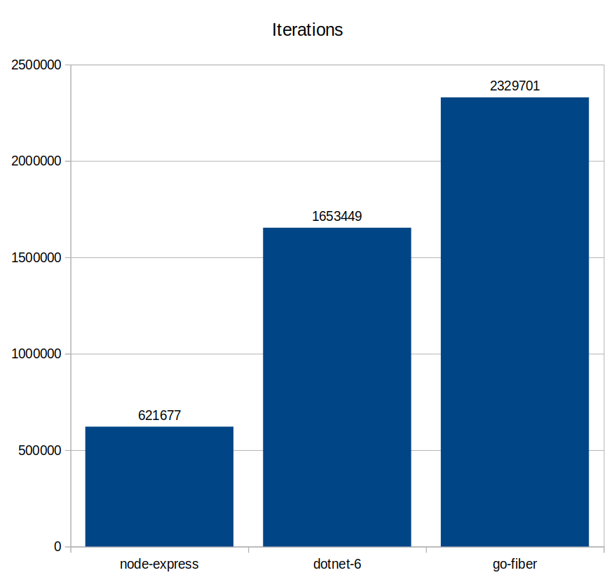

# ApiSmackdown

This repo is intended to allow comparison of the performance and simplicity (maintenance costs) of various API backend languages and frameworks.

## Setups

### Go (Fiber)

Setup modules and get the fiber module:

```bash
cd go-fiber
go mod init github.com/bernhard-hofmann/ApiSmackdown
go get github.com/gofiber/fiber
go run main.go
```

### Node (Express)

```bash
cd node-express
npm init
npm install express --save
```

### dotnet (6.0 rc1 minimal API)

Was created with

```bash
$HOME/dotnet/dotnet new web -o dotnet-6
```

Run it with

```bash
$HOME/dotnet/dotnet run
```

### k6 (Load testing)

Follow [the setup on the k6 website](https://k6.io/docs/getting-started/installation/).

## Results

To save the reader time, I'll publish results here. Note, these are from my laptop and are, as such, completely non-scientific. They may offer the reader some insight because the tests will be run one after the other at the same time on the same hardware.

```plaintext
bernhard@Latitude-5591:~/github/bernhard-hofmann/ApiSmackdown/k6$ k6 run go-fiber.js

          /\      |‾‾| /‾‾/   /‾‾/
     /\  /  \     |  |/  /   /  /
    /  \/    \    |     (   /   ‾‾\
   /          \   |  |\  \ |  (‾)  |
  / __________ \  |__| \__\ \_____/ .io

  execution: local
     script: go-fiber.js
     output: -

  scenarios: (100.00%) 1 scenario, 10 max VUs, 1m0s max duration (incl. graceful stop):
           * default: 10 looping VUs for 30s (gracefulStop: 30s)


running (0m30.0s), 00/10 VUs, 2329701 complete and 0 interrupted iterations
default ✓ [======================================] 10 VUs  30s

     data_received..................: 331 MB  11 MB/s
     data_sent......................: 186 MB  6.2 MB/s
     http_req_blocked...............: avg=1.51µs  min=646ns   med=1.34µs   max=2.74ms   p(90)=1.74µs   p(95)=2.19µs
     http_req_connecting............: avg=0ns     min=0s      med=0s       max=234.17µs p(90)=0s       p(95)=0s
     http_req_duration..............: avg=82.88µs min=27.63µs med=73.66µs  max=9.31ms   p(90)=113.01µs p(95)=131.31µs
       { expected_response:true }...: avg=82.88µs min=27.63µs med=73.66µs  max=9.31ms   p(90)=113.01µs p(95)=131.31µs
     http_req_failed................: 0.00%   ✓ 0            ✗ 2329701
     http_req_receiving.............: avg=16.5µs  min=5.36µs  med=14.69µs  max=7.76ms   p(90)=18.63µs  p(95)=23.29µs
     http_req_sending...............: avg=6.69µs  min=2.83µs  med=6.2µs    max=5.75ms   p(90)=7.58µs   p(95)=9.2µs
     http_req_tls_handshaking.......: avg=0s      min=0s      med=0s       max=0s       p(90)=0s       p(95)=0s
     http_req_waiting...............: avg=59.67µs min=15.92µs med=51.95µs  max=9.26ms   p(90)=88.42µs  p(95)=101.33µs
     http_reqs......................: 2329701 77654.472525/s
     iteration_duration.............: avg=123.6µs min=47.97µs med=107.48µs max=426ms    p(90)=151.25µs p(95)=181.39µs
     iterations.....................: 2329701 77654.472525/s
     vus............................: 10      min=10         max=10
     vus_max........................: 10      min=10         max=10

bernhard@Latitude-5591:~/github/bernhard-hofmann/ApiSmackdown/k6$ k6 run node-express.js

          /\      |‾‾| /‾‾/   /‾‾/
     /\  /  \     |  |/  /   /  /
    /  \/    \    |     (   /   ‾‾\
   /          \   |  |\  \ |  (‾)  |
  / __________ \  |__| \__\ \_____/ .io

  execution: local
     script: node-express.js
     output: -

  scenarios: (100.00%) 1 scenario, 10 max VUs, 1m0s max duration (incl. graceful stop):
           * default: 10 looping VUs for 30s (gracefulStop: 30s)


running (0m30.0s), 00/10 VUs, 621677 complete and 0 interrupted iterations
default ✓ [======================================] 10 VUs  30s

     data_received..................: 143 MB 4.8 MB/s
     data_sent......................: 50 MB  1.7 MB/s
     http_req_blocked...............: avg=951ns    min=618ns    med=763ns    max=493.02µs p(90)=1.33µs   p(95)=1.65µs
     http_req_connecting............: avg=0ns      min=0s       med=0s       max=84.06µs  p(90)=0s       p(95)=0s
     http_req_duration..............: avg=455.68µs min=79.53µs  med=382.11µs max=5.91ms   p(90)=748.61µs p(95)=813.53µs
       { expected_response:true }...: avg=455.68µs min=79.53µs  med=382.11µs max=5.91ms   p(90)=748.61µs p(95)=813.53µs
     http_req_failed................: 0.00%  ✓ 0            ✗ 621677
     http_req_receiving.............: avg=12.59µs  min=6.02µs   med=10.42µs  max=3.98ms   p(90)=16.86µs  p(95)=20.11µs
     http_req_sending...............: avg=4.42µs   min=2.93µs   med=3.54µs   max=1.7ms    p(90)=5.84µs   p(95)=6.93µs
     http_req_tls_handshaking.......: avg=0s       min=0s       med=0s       max=0s       p(90)=0s       p(95)=0s
     http_req_waiting...............: avg=438.66µs min=52.68µs  med=366.53µs max=4.06ms   p(90)=732.7µs  p(95)=794.53µs
     http_reqs......................: 621677 20721.795817/s
     iteration_duration.............: avg=479.62µs min=115.99µs med=404.48µs max=5.94ms   p(90)=771.18µs p(95)=839.84µs
     iterations.....................: 621677 20721.795817/s
     vus............................: 10     min=10         max=10
     vus_max........................: 10     min=10         max=10


bernhard@Latitude-5591:~/github/bernhard-hofmann/ApiSmackdown/k6$ k6 run dotnet-6.js

          /\      |‾‾| /‾‾/   /‾‾/
     /\  /  \     |  |/  /   /  /
    /  \/    \    |     (   /   ‾‾\
   /          \   |  |\  \ |  (‾)  |
  / __________ \  |__| \__\ \_____/ .io

  execution: local
     script: dotnet-6.js
     output: -

  scenarios: (100.00%) 1 scenario, 10 max VUs, 1m0s max duration (incl. graceful stop):
           * default: 10 looping VUs for 30s (gracefulStop: 30s)


running (0m30.0s), 00/10 VUs, 1653449 complete and 0 interrupted iterations
default ✓ [======================================] 10 VUs  30s

     data_received..................: 293 MB  9.8 MB/s
     data_sent......................: 132 MB  4.4 MB/s
     http_req_blocked...............: avg=1.83µs   min=572ns   med=1.39µs   max=6.85ms  p(90)=1.8µs    p(95)=2.43µs
     http_req_connecting............: avg=0ns      min=0s      med=0s       max=93.52µs p(90)=0s       p(95)=0s
     http_req_duration..............: avg=131.28µs min=46.58µs med=100.58µs max=44.75ms p(90)=182.64µs p(95)=244.4µs
       { expected_response:true }...: avg=131.28µs min=46.58µs med=100.58µs max=44.75ms p(90)=182.64µs p(95)=244.4µs
     http_req_failed................: 0.00%   ✓ 0            ✗ 1653449
     http_req_receiving.............: avg=23.93µs  min=6.89µs  med=16.32µs  max=15.77ms p(90)=22.94µs  p(95)=27.93µs
     http_req_sending...............: avg=8.16µs   min=2.97µs  med=6.39µs   max=14.09ms p(90)=8.07µs   p(95)=11.42µs
     http_req_tls_handshaking.......: avg=0s       min=0s      med=0s       max=0s      p(90)=0s       p(95)=0s
     http_req_waiting...............: avg=99.18µs  min=30.45µs med=74.95µs  max=44.65ms p(90)=149.28µs p(95)=199.14µs
     http_reqs......................: 1653449 55113.291313/s
     iteration_duration.............: avg=175.74µs min=68.23µs med=138.04µs max=44.99ms p(90)=231.55µs p(95)=309µs
     iterations.....................: 1653449 55113.291313/s
     vus............................: 10      min=10         max=10
     vus_max........................: 10      min=10         max=10

```


